<!-- HEADER & BANNER -->

  

<h1 align="center"> </h1>

  🚀 Flutter & .NET Core Developer | Cross-Platform Apps | Scalable Web & Mobile Solutions | API & Cloud Services

<!-- ABOUT ME -->
<h2 align="center">👋 About Me</h2>

  <b>Full-Stack Developer</b> specializing in <b>Flutter</b> & <b>ASP.NET Core</b>. 
  I build high-performance, scalable mobile & web applications with a focus on clean architecture and efficient APIs.

<ul align="center">
  <li>📱 <b>Mobile:</b> Android & iOS apps using Flutter (MVVM, Clean Architecture)</li>
  <li>🛡️ <b>Backend:</b> Secure APIs with ASP.NET Core, Firebase, SQL</li>
  <li>🔗 <b>Integrations:</b> 3rd-party APIs, SDKs, Stripe, Gemini AI</li>
  <li>🗂️ <b>Project Management:</b> End-to-end delivery, CI/CD, team leadership</li>
</ul>

  
  
  

---

<!-- CONTACT -->
<h2 align="center">📫 Contact</h2>

  
  
  

---

<!-- TECH STACK -->
<h2 align="center">🛠️ Tech Stack</h2>

  
  
  
  
  
  
  
  
  
  
  
  
  
  
  
  
  
  
  
  
  
  
  
  
  
  
  
  
  
  
  
  
  
  
  
  
  
  
  

---

<!-- FEATURED PROJECTS -->
<h2 align="center">🚀 Featured Projects</h2>

  <table>
    <tr>
      <td align="center" width="220">
        <a href="https://github.com/jamalihassan0307/Seekho" target="_blank">
          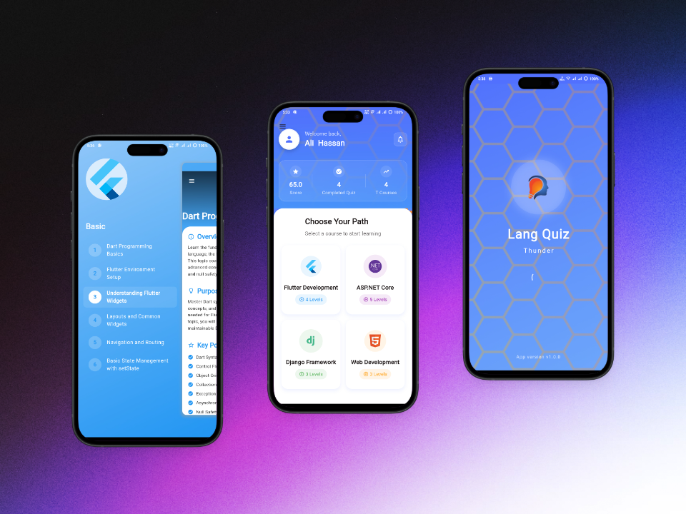
        </a> 
        <b>Seekho</b> 
        Educational App | Flutter, Firebase 
        <a href="https://github.com/jamalihassan0307/Seekho/releases/download/1.0.1/app-armeabi-v7a-release.apk"><b>APK</b></a>
      </td>
      <td align="center" width="220">
        <a href="https://github.com/jamalihassan0307/Elderly-Exercisec-App" target="_blank">
          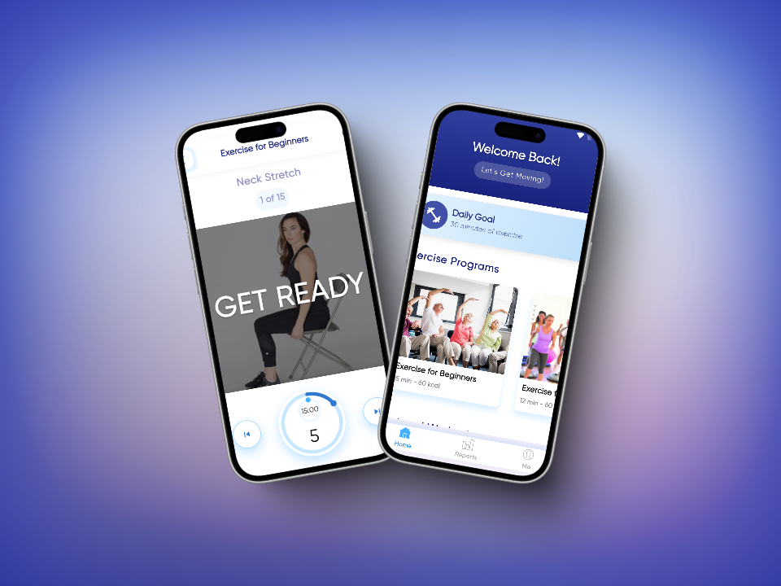
        </a> 
        <b>Elderly-Exercisec-App</b> 
        Fitness for Elderly | Flutter, SQLite 
        <a href="https://github.com/jamalihassan0307/Elderly-Exercisec-App/releases/download/1.1.0/app-armeabi-v7a-release.apk"><b>APK</b></a>
      </td>
      <td align="center" width="220">
        <a href="https://github.com/jamalihassan0307/ChatGPT-APP" target="_blank">
          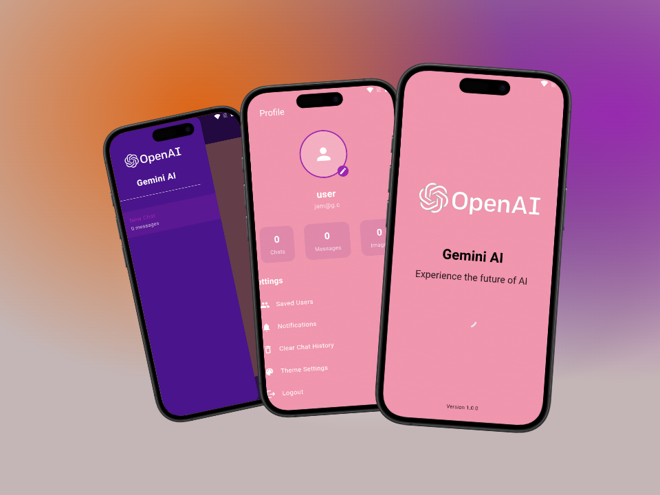
        </a> 
        <b>ChatGPT-APP</b> 
        AI Chat & Image | Flutter, REST API 
        <a href="https://github.com/jamalihassan0307/ChatGPT-APP/releases/download/1.1.0/app-armeabi-v7a-release.apk"><b>APK</b></a>
      </td>
    </tr>
    <tr>
      <td align="center" width="220">
        <a href="https://github.com/jamalihassan0307/PetShop" target="_blank">
          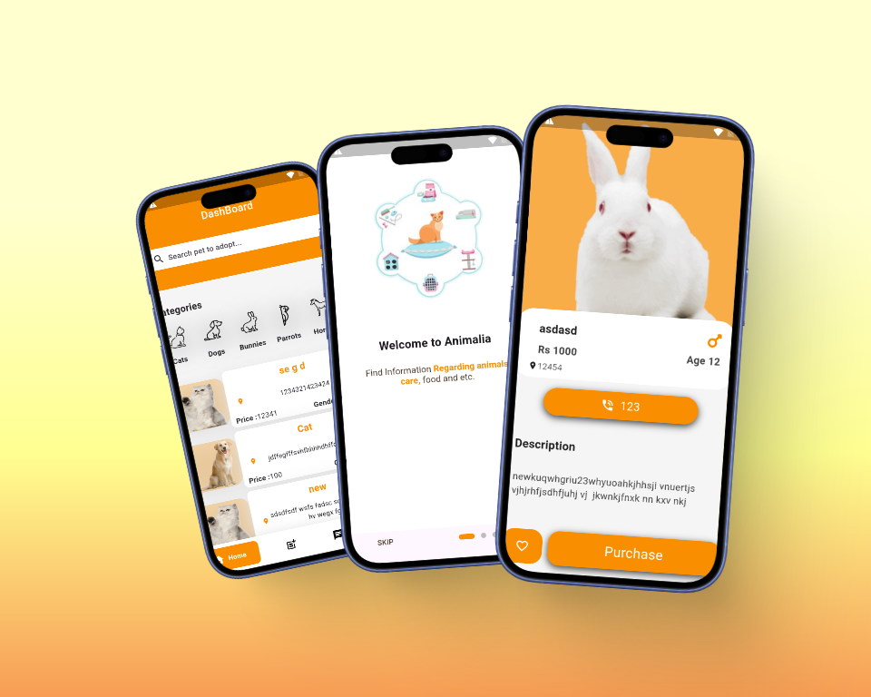
        </a> 
        <b>PetShop</b> 
        Pet Care | Flutter, Firebase 
        <a href="https://github.com/jamalihassan0307/PetShop/releases/download/1.1.0/app-release.apk"><b>APK</b></a>
      </td>
      <td align="center" width="220">
        <a href="https://github.com/jamalihassan0307/Black-Stage" target="_blank">
          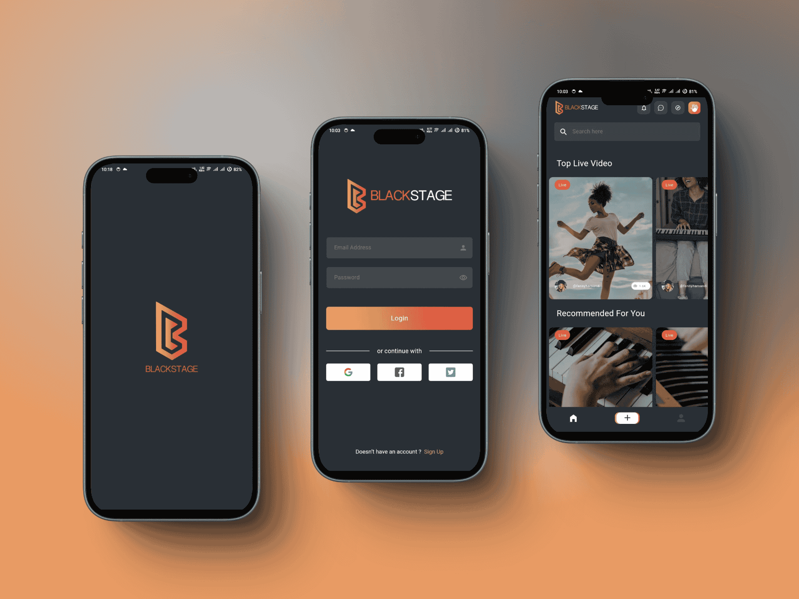
        </a> 
        <b>Black Stage</b> 
        Social & Streaming | Flutter, Firebase 
        <a href="https://github.com/jamalihassan0307/Black-Stage/releases/download/1.1.0/app-debug.apk"><b>APK</b></a>
      </td>
      <td align="center" width="220">
         
        <b>YTHub</b> 
        YouTube Browser | Flutter, Google APIs 
        <a href="https://github.com/jamalihassan0307/YTHub/releases/download/1.1.0/app-release.apk"><b>APK</b></a>
      </td>
    </tr>
    <tr>
      <td align="center" width="220">
        <a href="https://github.com/jamalihassan0307/LudoVerse" target="_blank">
          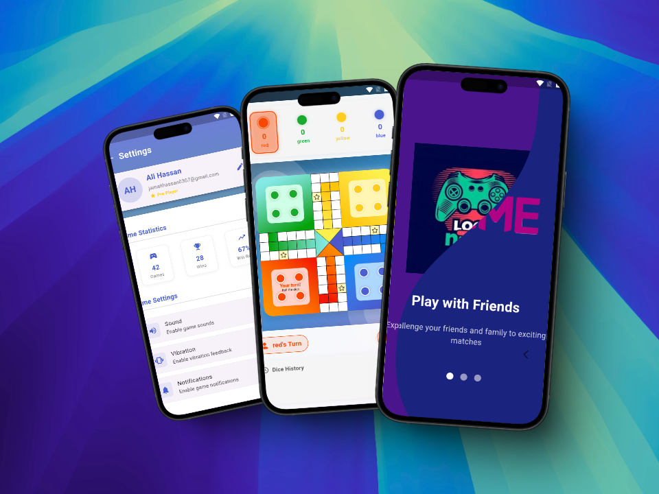
        </a> 
        <b>LudoVerse</b> 
        Ludo Game | Flutter 
        <a href="https://github.com/jamalihassan0307/LudoVerse/releases/download/1.0.1/app-armeabi-v7a-release.apk"><b>APK</b></a>
      </td>
      <td align="center" width="220">
        <a href="https://github.com/jamalihassan0307/Furniture-Purchesing-App" target="_blank">
          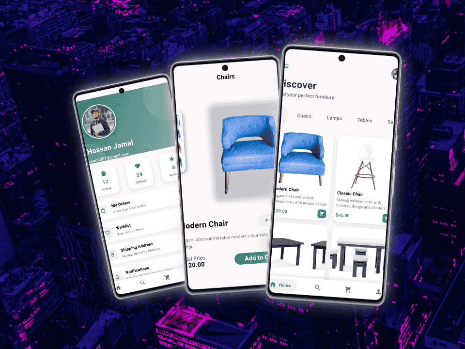
        </a> 
        <b>Furniture App</b> 
        Shopping | Flutter 
        <a href="https://github.com/jamalihassan0307/Furniture-Purchesing-App/releases/download/1.0.0/app-armeabi-v7a-release.apk"><b>APK</b></a>
      </td>
      <td align="center" width="220">
        <a href="https://github.com/jamalihassan0307/Course-Tracker" target="_blank">
          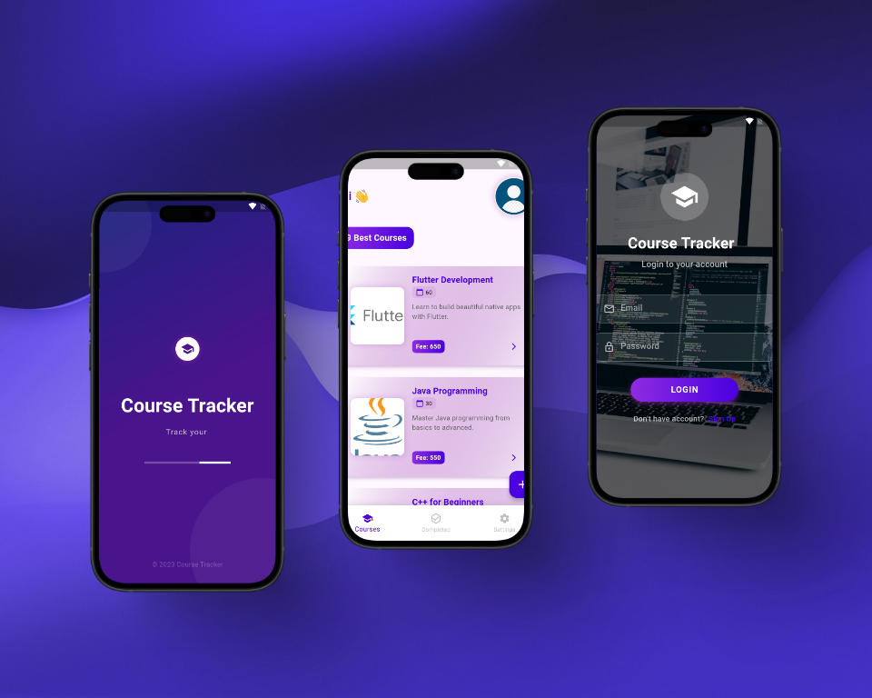
        </a> 
        <b>Course Tracker</b> 
        Learning Progress | Flutter, SQLite 
        <a href="https://github.com/jamalihassan0307/Course-Tracker/releases/download/1.0.0/app-release.apk"><b>APK</b></a>
      </td>
    </tr>
    <tr>
      <td align="center" width="220">
        <a href="https://github.com/jamalihassan0307/EasyVid" target="_blank">
          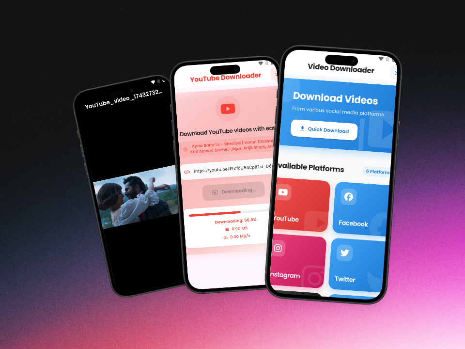
        </a> 
        <b>EasyVid</b> 
        Video Downloader | Flutter 
        <a href="https://github.com/jamalihassan0307/EasyVid/releases/download/1.0.0/app-release.apk"><b>APK</b></a>
      </td>
      <td align="center" width="220">
        <a href="https://github.com/jamalihassan0307/HealthConnect" target="_blank">
          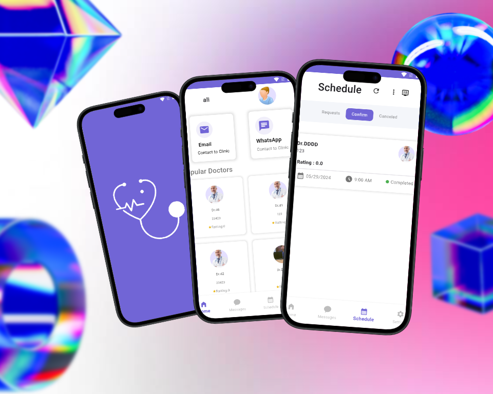
        </a> 
        <b>HealthConnect</b> 
        Healthcare Platform | Flutter, Firebase 
        <a href="https://github.com/jamalihassan0307/HealthConnect/releases/download/1.0.0/app-release.apk"><b>APK</b></a>
      </td>
      <td align="center" width="220">
        <a href="https://github.com/jamalihassan0307/Flutter-passkeys-authentication" target="_blank">
          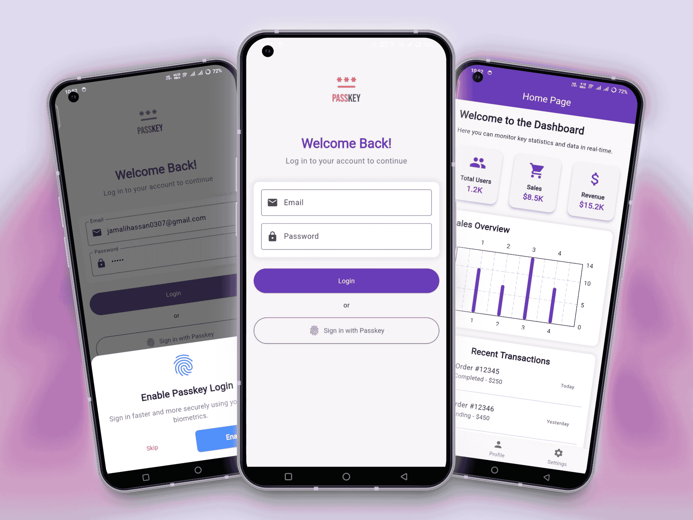
        </a> 
        <b>PassKey Auth</b> 
        Biometrics | Flutter 
        <a href="https://github.com/jamalihassan0307/Flutter-passkeys-authentication/releases/download/1.0.1/app-arm64-v8a-release.apk"><b>APK</b></a>
      </td>
    </tr>
    <tr>
      <td align="center" width="220">
        <a href="https://github.com/jamalihassan0307/ShopEase" target="_blank">
          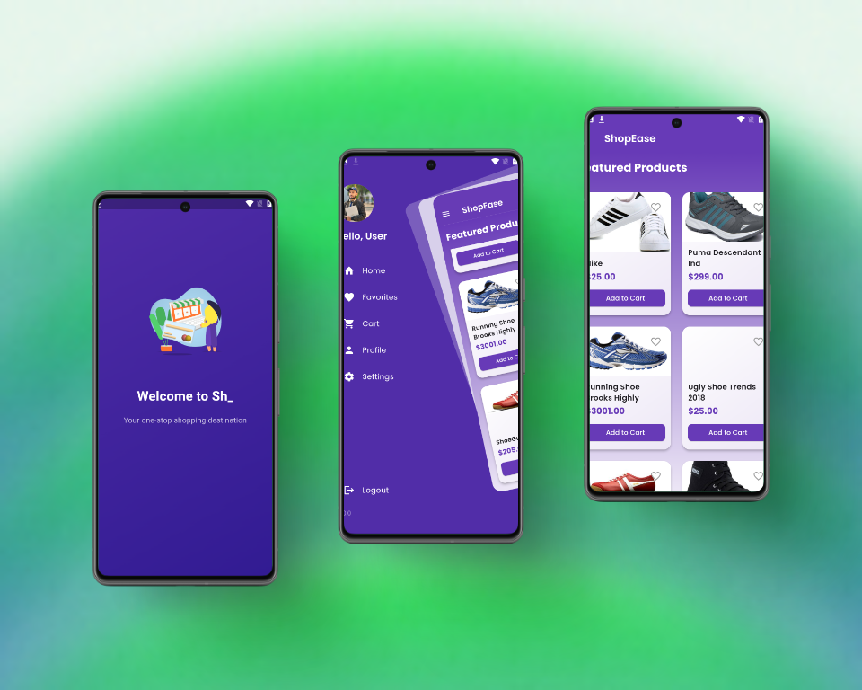
        </a> 
        <b>ShopEase</b> 
        Shopping | Flutter, Firebase 
        <a href="https://github.com/jamalihassan0307/ShopEase/releases/download/1.0.0/app-release.apk"><b>APK</b></a>
      </td>
      <td align="center" width="220">
        <a href="https://github.com/jamalihassan0307/Food-Dairy-app-sql" target="_blank">
          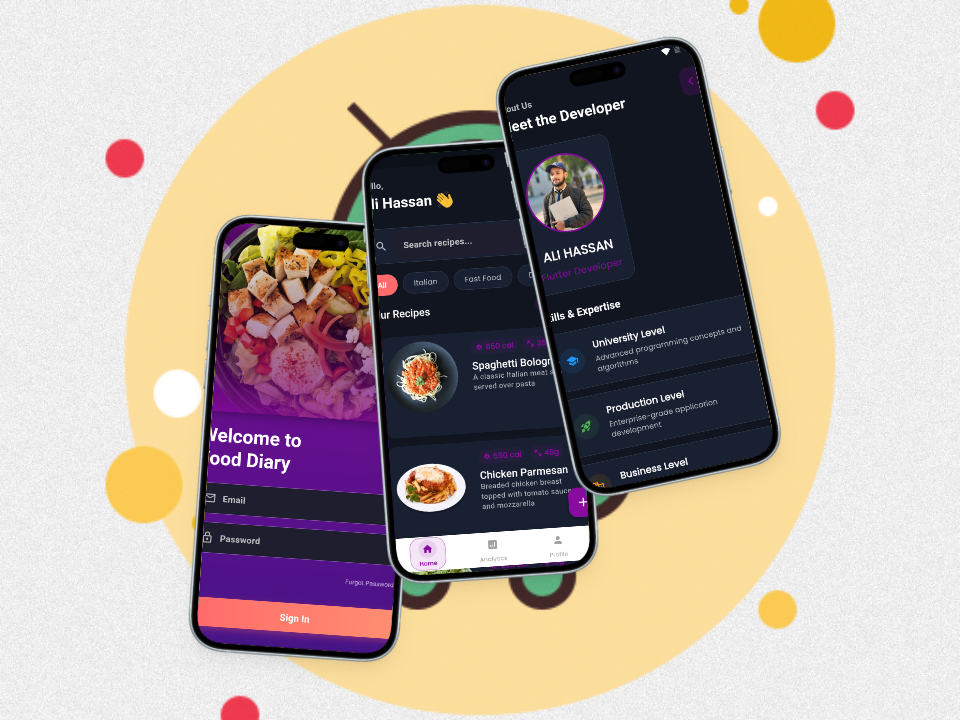
        </a> 
        <b>Food Dairy</b> 
        Nutrition Tracker | Flutter, SQLite 
        <a href="https://github.com/jamalihassan0307/Food-Dairy-app-sql/releases/download/1.0.0/app-release.apk"><b>APK</b></a>
      </td>
      <td align="center" width="220">
        <a href="https://github.com/jamalihassan0307/PetCare-Pro" target="_blank">
          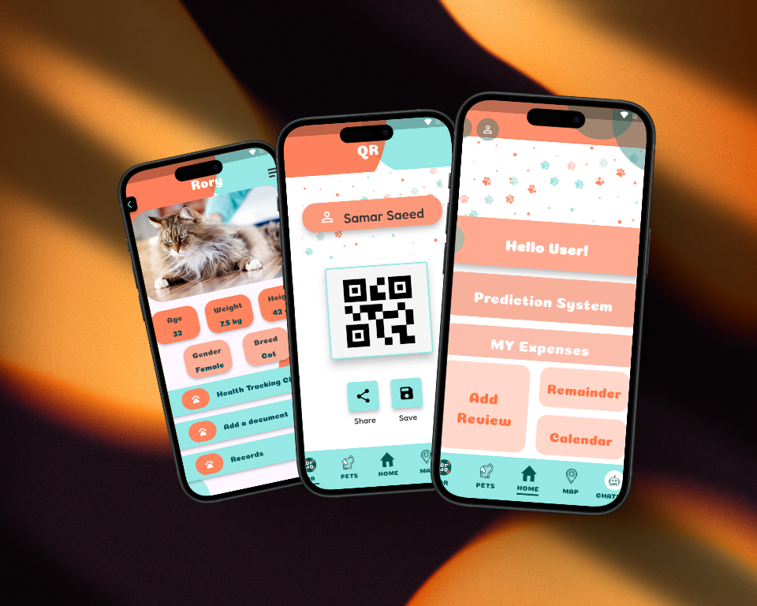
        </a> 
        <b>PetCare-Pro</b> 
        Pet Health | Flutter 
        <a href="https://github.com/jamalihassan0307/PetCare-Pro/releases/download/1.0.1/app-release.apk"><b>APK</b></a>
      </td>
    </tr>
    <tr>
      <td align="center" width="220">
        <a href="https://github.com/jamalihassan0307/Snab-Budget" target="_blank">
          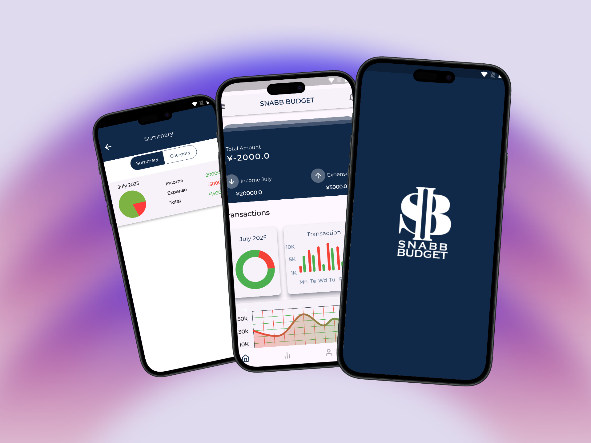
        </a> 
        <b>Snabb Budget</b> 
        Budget Management | Flutter, Dart 
        <a href="https://github.com/jamalihassan0307/Snab-Budget/releases/download/1.0.1/app-armeabi-v7a-release.apk"><b>APK</b></a>
      </td>
      <td align="center" width="220">
        <a href="https://github.com/jamalihassan0307/TaxTip" target="_blank">
          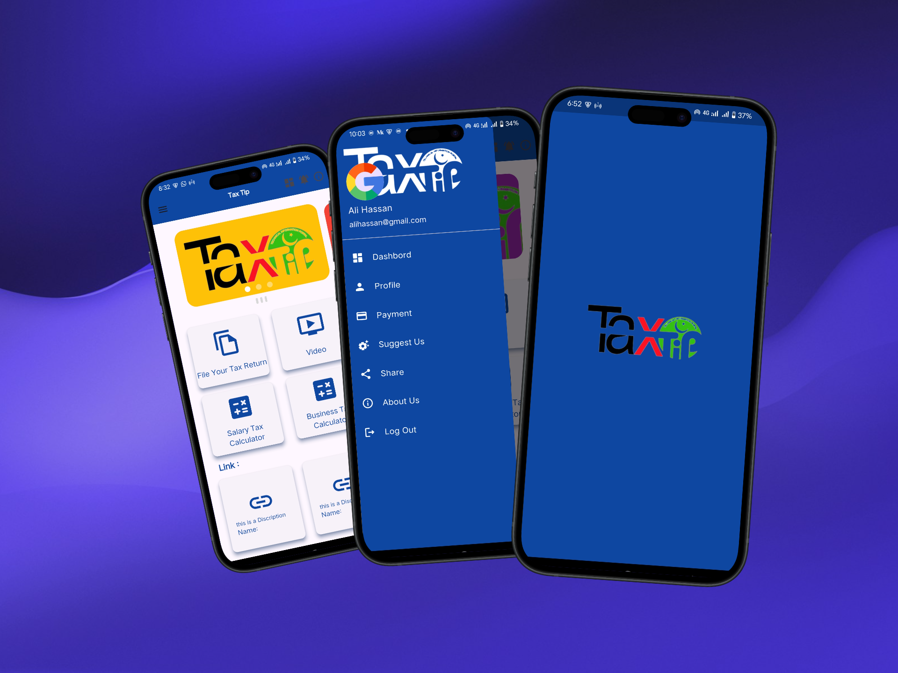
        </a> 
        <b>Taxtip</b> 
        Tax Management | Flutter 
        <a href="https://github.com/jamalihassan0307/TaxTip/releases/download/1.0.1/app-release.apk"><b>APK</b></a>
      </td>
      <td align="center" width="220">
        <a href="https://github.com/jamalihassan0307/Ui-kit" target="_blank">
          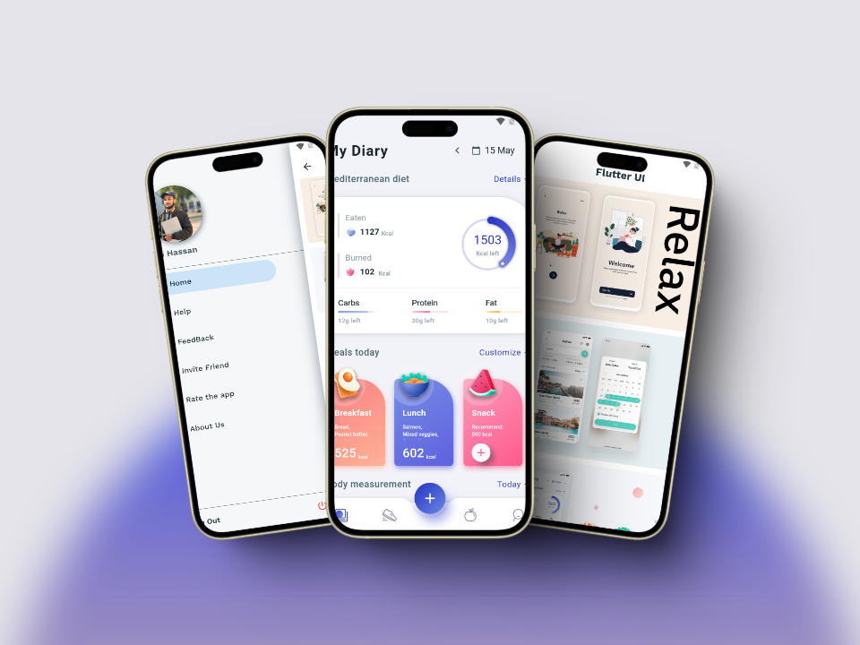
        </a> 
        <b>Ui-kit</b> 
        UI Animations | Flutter 
        <a href="https://github.com/jamalihassan0307/Ui-kit/releases/download/1.0.0/app-armeabi-v7a-release.apk"><b>APK</b></a>
      </td>
    </tr>
    <tr>
      <td align="center" width="220">
         
        <b>Travel Blogging</b> 
        Blog Platform | React, Firebase 
        <a href="https://jamalihassan0307.github.io/travel-blogging-platfoam/"><b>Demo</b></a>
      </td>
      <td align="center" width="220">
        <a href="https://github.com/jamalihassan0307/Flutter-Cake-App" target="_blank">
          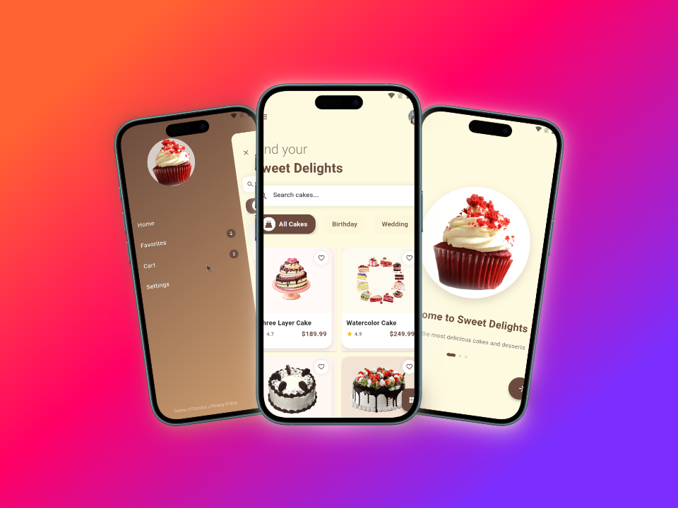
        </a> 
        <b>Cake App</b> 
        Cake Ordering | Flutter 
        <a href="https://github.com/jamalihassan0307/Flutter-Cake-App/blob/main/APK/app-armeabi-v7a-release.apk"><b>APK</b></a>
      </td>
      <td align="center" width="220">
         
        <b>IQRA</b> 
        Islamic App | Flutter, Firebase 
        <a href="https://github.com/jamalihassan0307/IQRA/releases/download/1.0.0/app-armeabi-v7a-release.apk"><b>APK</b></a>
      </td>
    </tr>
    <tr>
      <td align="center" width="220">
        <a href="https://github.com/jamalihassan0307/7Skies" target="_blank">
          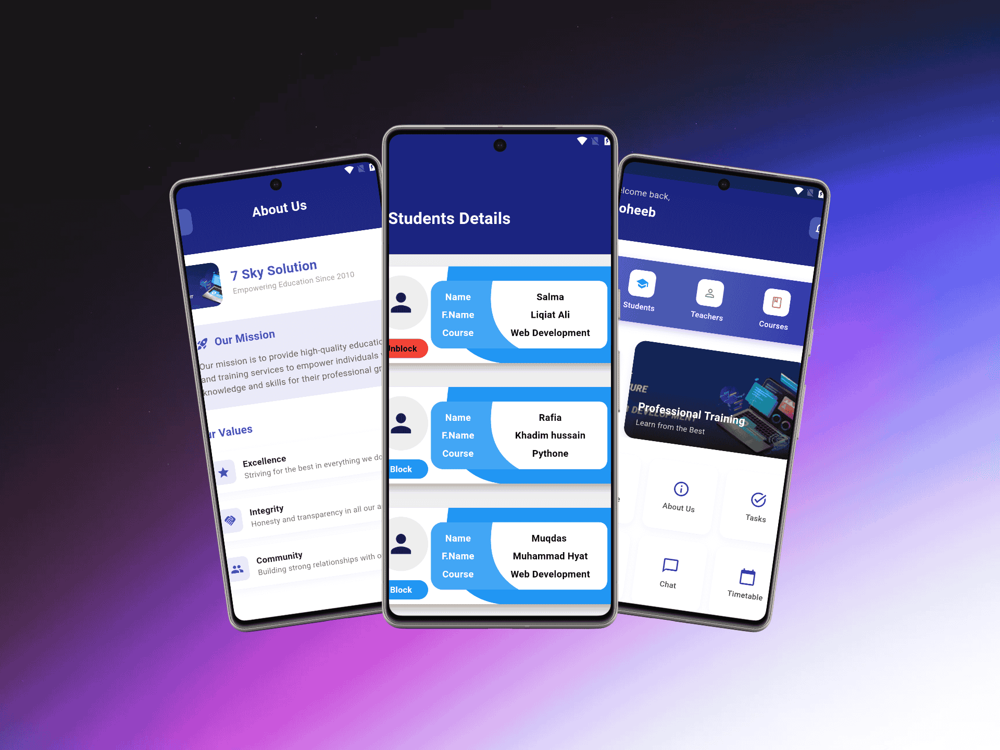
        </a> 
        <b>7 Skies Solution</b> 
        Educational Management | Flutter, Firebase 
        <a href="https://github.com/jamalihassan0307/7Skies/releases/download/1.0.0/app.apk"><b>APK</b></a>
      </td>
      <td align="center" width="220">
        <a href="https://github.com/jamalihassan0307/Snab-Business" target="_blank">
          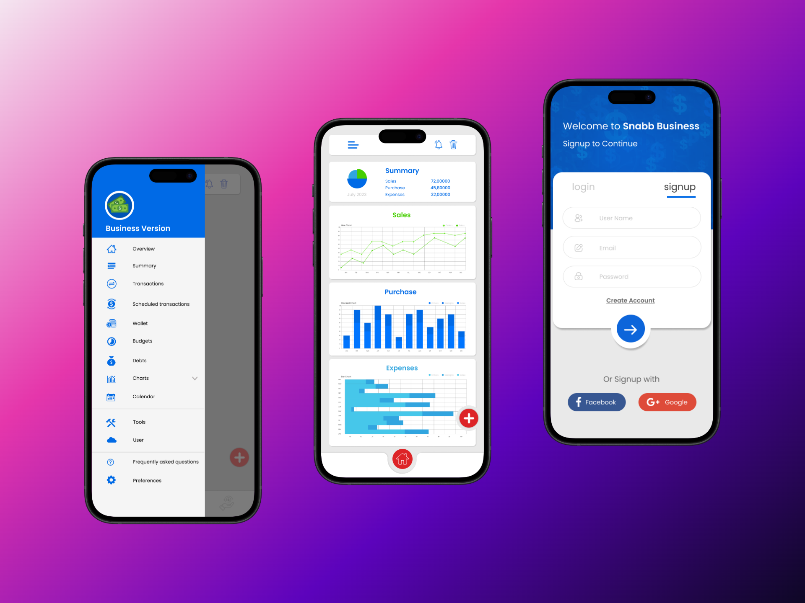
        </a> 
        <b>Snab Business</b> 
        Business & Finance | Flutter 
        <a href="#"><b>Demo</b></a>
      </td>
      <td align="center" width="220">
        <a href="https://github.com/jamalihassan0307/Simple-Ludo" target="_blank">
          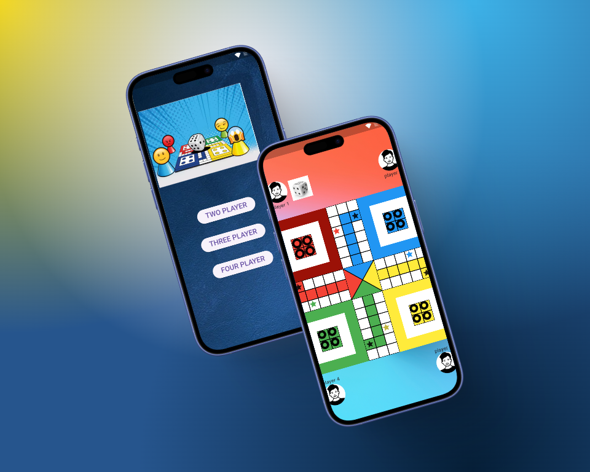
        </a> 
        <b>Ludo App</b> 
        Ludo Game | Flutter 
        <a href="https://github.com/jamalihassan0307/Simple-Ludo/releases/download/1.0.0/app-debug.1.apk"><b>APK</b></a>
      </td>
    </tr>
    <tr>
      <td align="center" width="220">
        <a href="https://github.com/jamalihassan0307/Food-Dairy-app-sql" target="_blank">
          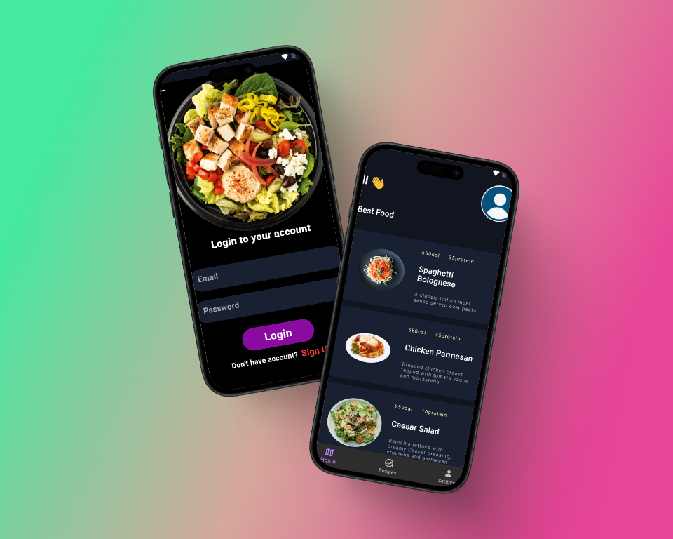
        </a> 
        <b>Food SQLite Banner</b> 
        Food Tracker | Flutter, SQLite 
        <a href="https://github.com/jamalihassan0307/Food-Dairy-app-sql/releases/download/1.0.0/app-release.apk"><b>APK</b></a>
      </td>
      <td align="center" width="220">
        <a href="https://github.com/jamalihassan0307/Healthcare-Management-System" target="_blank">
          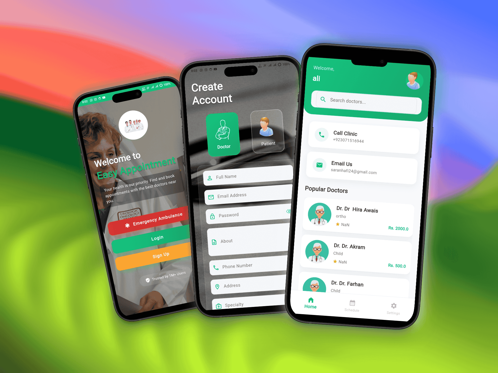
        </a> 
        <b>Healthcare Management</b> 
        Healthcare | Flutter, Firebase 
        <a href="#"><b>Demo</b></a>
      </td>
      <td align="center" width="220">
         
        <b>Pet Shop</b> 
        Pet Care | Flutter, Firebase 
        <a href="https://github.com/jamalihassan0307/PetShop/releases/download/1.1.0/app-release.apk"><b>APK</b></a>
      </td>
    </tr>
  </table>

---

<!-- CERTIFICATIONS -->
<h2 align="center">📜 Certifications</h2>

<ul>
  <li><b>AI Ethics</b> – DataCamp</li>
  <li><b>Data Processing in Shell</b> – DataCamp</li>
  <li><b>Introduction to LLMs in Python</b> – DataCamp</li>
  <li><b>Introduction to Mobile App Development With Flutter</b> – Alison</li>
  <li><b>Software Engineer</b> – HackerRank</li>
  <li><b>Software Engineer Intern</b> – HackerRank</li>
  <li><b>Understanding Data Science</b> – DataCamp</li>
  <li><b>Working with the OpenAI API</b> – DataCamp</li>
  <li><b>Introduction to GitHub Concepts</b> – DataCamp</li>
  <li><b>Introduction to ChatGPT</b> – DataCamp</li>
</ul>

---

<!-- EDUCATION -->
## 🎓 Education
**The Islamia University of Bahawalpur**  
Bachelor's in Computer Science (2022–2026)  
CGPA: 3.57  
- Open-source projects, tech workshops, AI, web & mobile dev

---

<!-- GITHUB STATS & TROPHIES -->
## 📊 GitHub Stats

  
  
  

---

<!-- DECORATIVE ELEMENTS -->

  

