<!-- HEADER & BANNER -->

  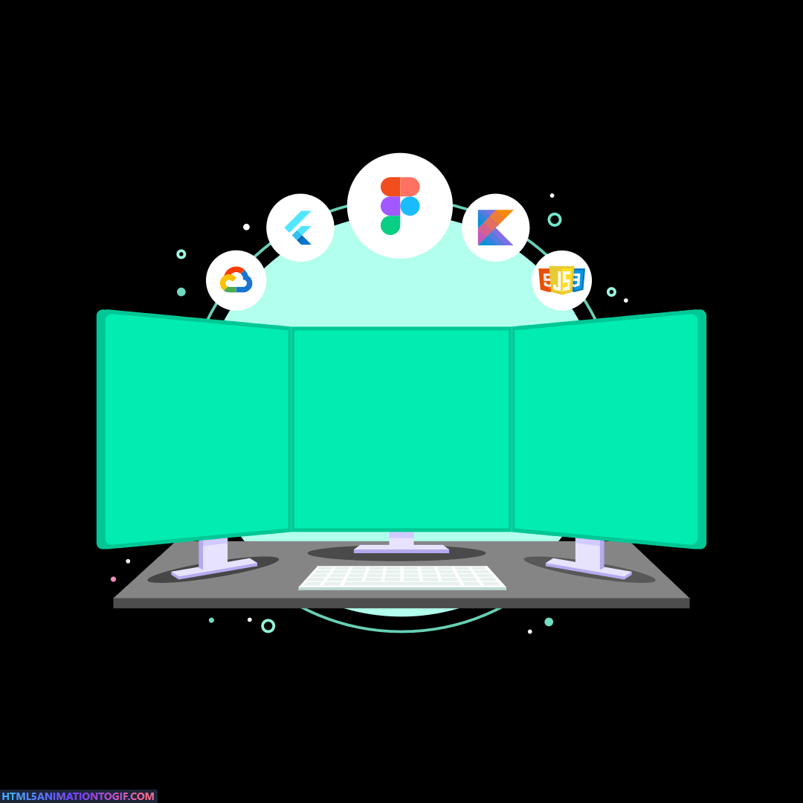

<h1 align="center"> </h1>

  🚀 Flutter Developer | Django Backend Developer | AI-Augmented Full-Stack Engineer | Package Creator (150+ Pub Points) | Open Source Contributor

<!-- ABOUT ME -->
<h2 align="center">👋 About Me</h2>

  <b>Full-Stack Developer</b> specializing in <b>Flutter</b> & <b>Django</b>, with growing experience in <b>React.js</b> and <b>Next.js</b>. 
  I build high-performance, scalable mobile & web applications with a focus on clean architecture, efficient APIs, and AI-assisted development workflows.

<ul align="center">
  <li>📱 <b>Mobile:</b> Android & iOS apps using Flutter (MVVM, Clean Architecture)</li>
  <li>🐍 <b>Backend:</b> Django, Django REST Framework, Firebase, SQL/REST API integration</li>
  <li>🌐 <b>Web:</b> React.js, Next.js front-ends on Django REST API backends</li>
  <li>🔗 <b>Integrations:</b> 3rd-party APIs, SDKs, Stripe, Gemini AI</li>
  <li>🤖 <b>AI-Assisted Workflow:</b> Claude Code, GitHub Copilot, Cursor, Google Antigravity, Google AI Studio, Lovable</li>
  <li>🗂️ <b>Project Management:</b> End-to-end delivery, CI/CD, team leadership</li>
</ul>

  
  
  
  
  

---

## Featured Repos

  
  

  
 

   
  

  <a href="https://github.com/jamalihassan0307?tab=repositories&q=&type=&language=&sort=stargazers">View all repositories sorted by stars</a>

> Note: your original pinned repos were flutter-fly, LudoVerse, glassmorphic_ui_kit, Ui-kit, Simple-Ludo, Fast-OpenVPN, and Seekho — all Flutter. Since your positioning now leads with Django too, I swapped two slots to your Django tools (django-kick-start, Advanced-HTML-Django-Snippets) so the pinned repos back up the headline. Adjust back if you'd rather keep it pure Flutter.

---
<!-- TECH STACK -->
<h2 align="center">🛠️ Tech Stack</h2>

  
  
  
  
  
  
  
  
  
  
  
  
  
  
  
  
  
  
  
  
  
  
  
  
  
  
  
  
  
  
  
  
  

<h3 align="center">🤖 AI-Assisted Development</h3>

  
  
  
  
  
  

> Note: shields.io doesn't have official logo icons for "Antigravity" or "Lovable," so those two badges render as plain colored badges (no logo mark) — the text still shows correctly.

---

<!-- FEATURED PROJECTS -->
<h2 align="center">🚀 Featured Projects</h2>

<h3 align="center">Web (Django / React / Next.js)</h3>

<i>Add your web project cards here once you share names, repos, and screenshots — same table format as below.</i>

<h3 align="center">Mobile (Flutter)</h3>

  <table>
    <tr>
      <td align="center" width="220">
        <a href="https://github.com/jamalihassan0307/Seekho" target="_blank">
          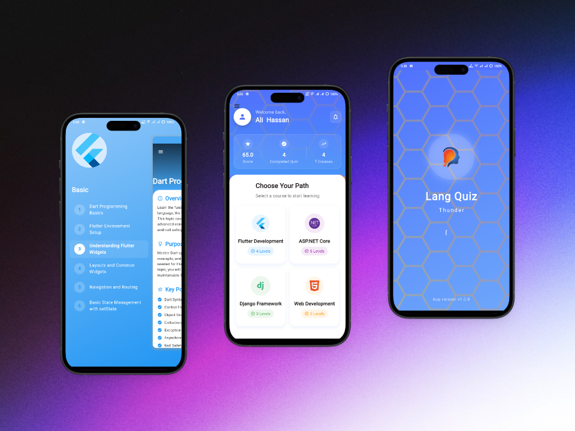
        </a> 
        <b>Seekho</b> 
        Educational App | Flutter, Firebase 
        <a href="https://github.com/jamalihassan0307/Seekho/releases/download/1.0.1/app-armeabi-v7a-release.apk"><b>APK</b></a>
      </td>
      <td align="center" width="220">
        <a href="https://github.com/jamalihassan0307/Elderly-Exercisec-App" target="_blank">
          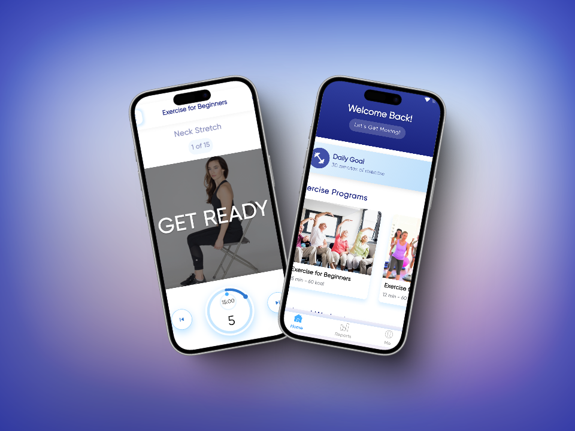
        </a> 
        <b>Elderly-Exercisec-App</b> 
        Fitness for Elderly | Flutter, SQLite 
        <a href="https://github.com/jamalihassan0307/Elderly-Exercisec-App/releases/download/1.1.0/app-armeabi-v7a-release.apk"><b>APK</b></a>
      </td>
      <td align="center" width="220">
        <a href="https://github.com/jamalihassan0307/ChatGPT-APP" target="_blank">
          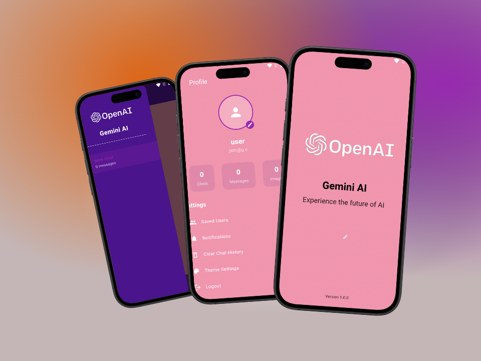
        </a> 
        <b>ChatGPT-APP</b> 
        AI Chat & Image | Flutter, REST API 
        <a href="https://github.com/jamalihassan0307/ChatGPT-APP/releases/download/1.1.0/app-armeabi-v7a-release.apk"><b>APK</b></a>
      </td>
    </tr>
    <tr>
      <td align="center" width="220">
        <a href="https://github.com/jamalihassan0307/PetShop" target="_blank">
          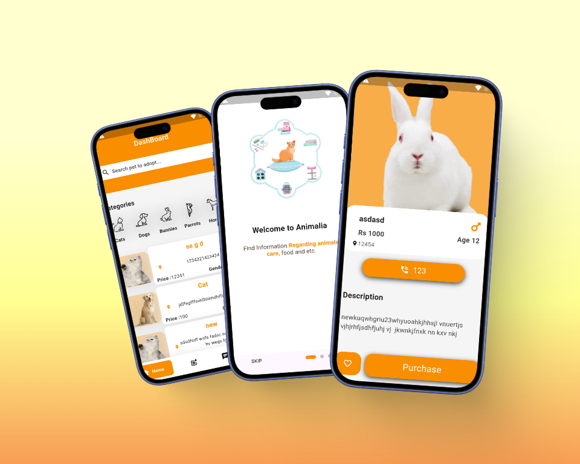
        </a> 
        <b>PetShop</b> 
        Pet Care | Flutter, Firebase 
        <a href="https://github.com/jamalihassan0307/PetShop/releases/download/1.1.0/app-release.apk"><b>APK</b></a>
      </td>
      <td align="center" width="220">
        <a href="https://github.com/jamalihassan0307/Black-Stage" target="_blank">
          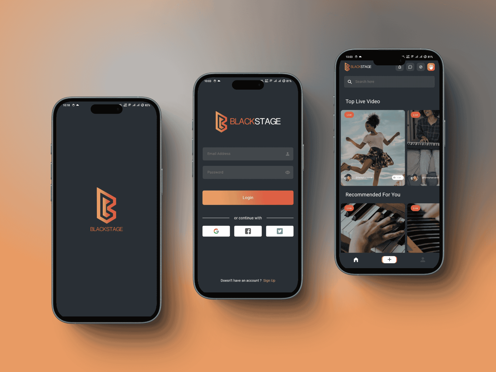
        </a> 
        <b>Black Stage</b> 
        Social & Streaming | Flutter, Firebase 
        <a href="https://github.com/jamalihassan0307/Black-Stage/releases/download/1.1.0/app-debug.apk"><b>APK</b></a>
      </td>
      <td align="center" width="220">
         
        <b>YTHub</b> 
        YouTube Browser | Flutter, Google APIs 
        <a href="https://github.com/jamalihassan0307/YTHub/releases/download/1.1.0/app-release.apk"><b>APK</b></a>
      </td>
    </tr>
    <tr>
      <td align="center" width="220">
        <a href="https://github.com/jamalihassan0307/LudoVerse" target="_blank">
          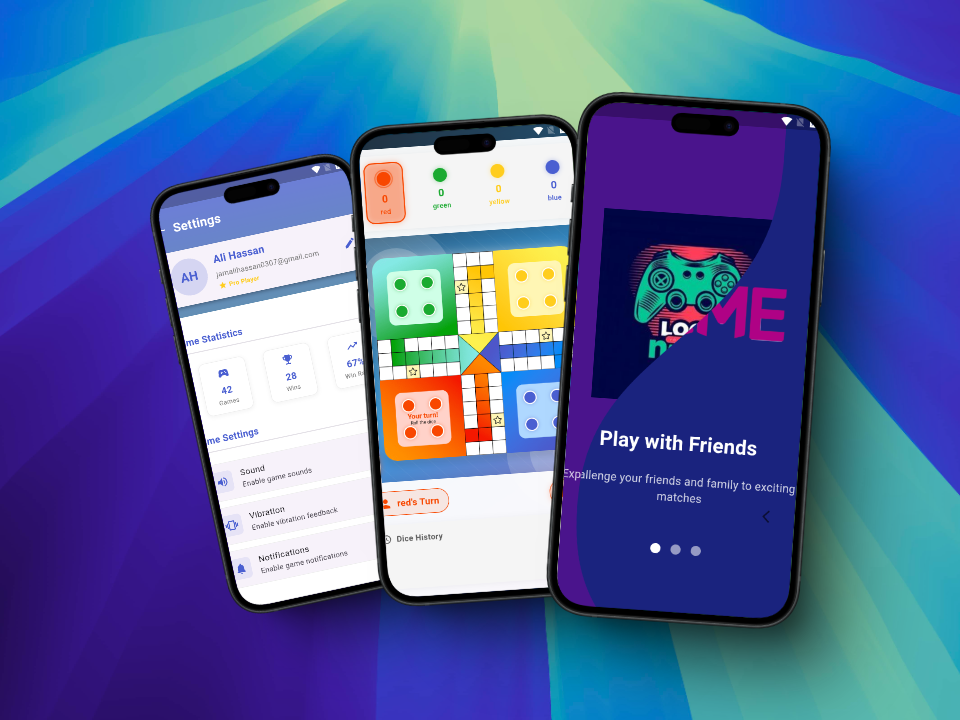
        </a> 
        <b>LudoVerse</b> 
        Ludo Game | Flutter 
        <a href="https://github.com/jamalihassan0307/LudoVerse/releases/download/1.0.1/app-armeabi-v7a-release.apk"><b>APK</b></a>
      </td>
      <td align="center" width="220">
        <a href="https://github.com/jamalihassan0307/Furniture-Purchesing-App" target="_blank">
          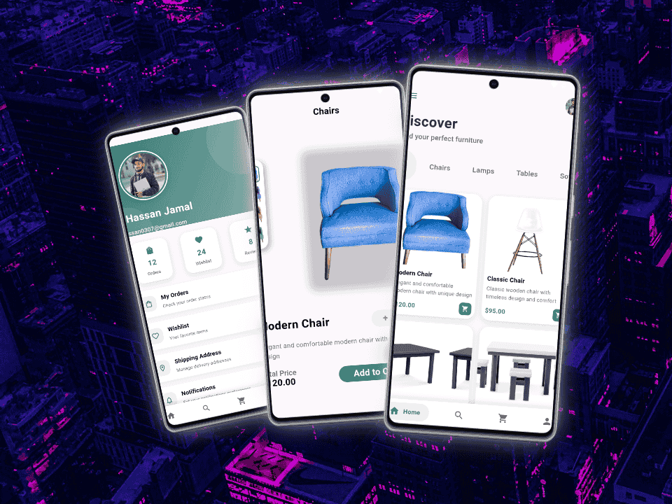
        </a> 
        <b>Furniture App</b> 
        Shopping | Flutter 
        <a href="https://github.com/jamalihassan0307/Furniture-Purchesing-App/releases/download/1.0.0/app-armeabi-v7a-release.apk"><b>APK</b></a>
      </td>
      <td align="center" width="220">
        <a href="https://github.com/jamalihassan0307/Course-Tracker" target="_blank">
          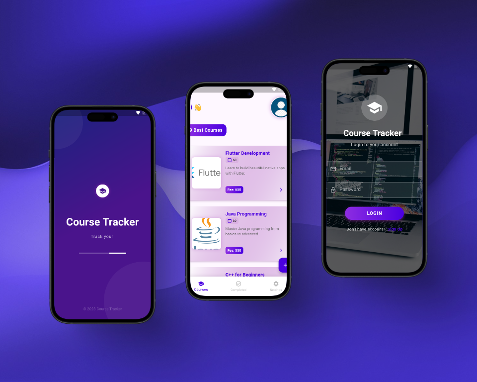
        </a> 
        <b>Course Tracker</b> 
        Learning Progress | Flutter, SQLite 
        <a href="https://github.com/jamalihassan0307/Course-Tracker/releases/download/1.0.0/app-release.apk"><b>APK</b></a>
      </td>
    </tr>
    <tr>
      <td align="center" width="220">
        <a href="https://github.com/jamalihassan0307/EasyVid" target="_blank">
          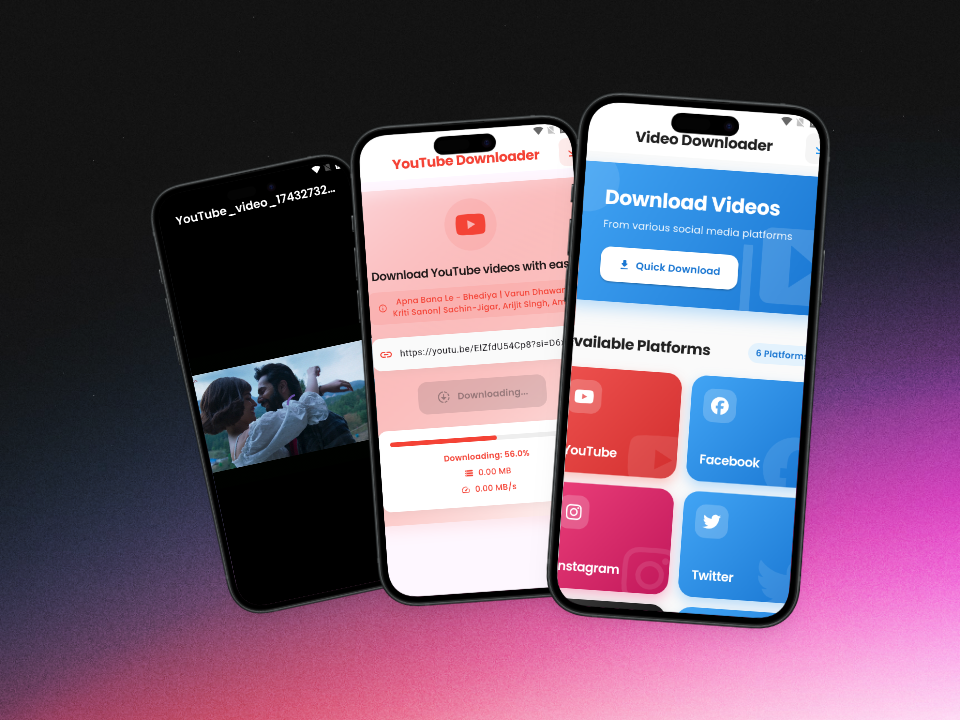
        </a> 
        <b>EasyVid</b> 
        Video Downloader | Flutter 
        <a href="https://github.com/jamalihassan0307/EasyVid/releases/download/1.0.0/app-release.apk"><b>APK</b></a>
      </td>
      <td align="center" width="220">
        <a href="https://github.com/jamalihassan0307/HealthConnect" target="_blank">
          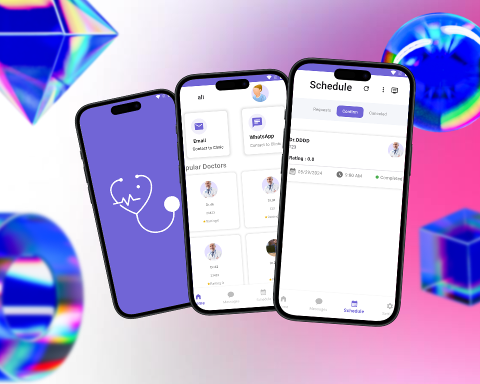
        </a> 
        <b>HealthConnect</b> 
        Healthcare Platform | Flutter, Firebase 
        <a href="https://github.com/jamalihassan0307/HealthConnect/releases/download/1.0.0/app-release.apk"><b>APK</b></a>
      </td>
      <td align="center" width="220">
        <a href="https://github.com/jamalihassan0307/Flutter-passkeys-authentication" target="_blank">
          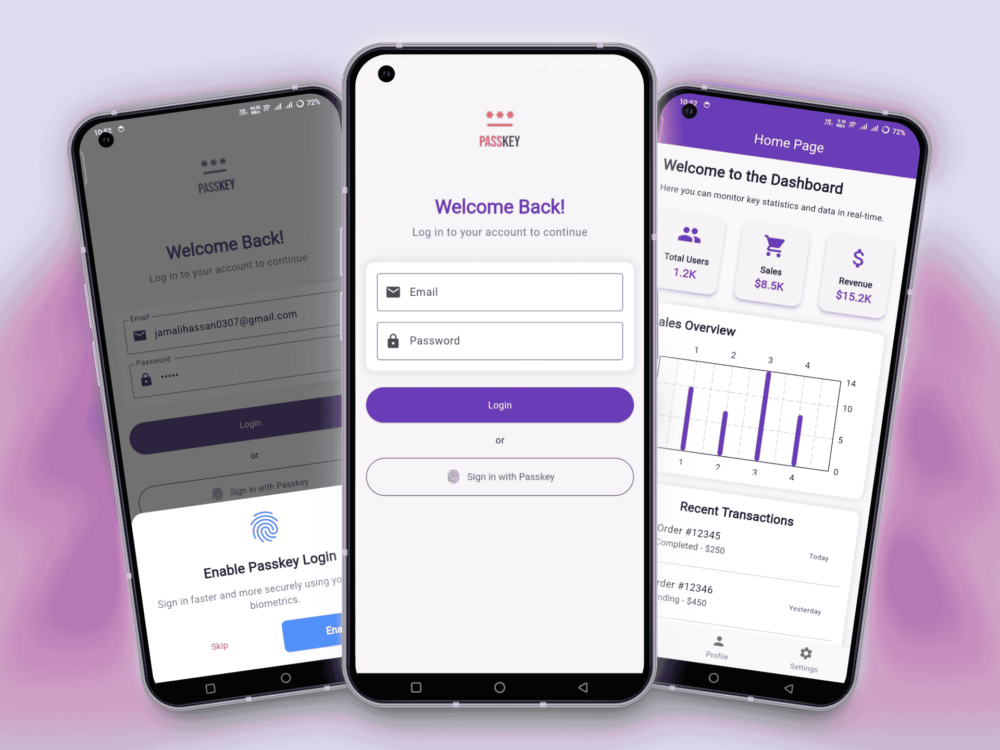
        </a> 
        <b>PassKey Auth</b> 
        Biometrics | Flutter 
        <a href="https://github.com/jamalihassan0307/Flutter-passkeys-authentication/releases/download/1.0.1/app-arm64-v8a-release.apk"><b>APK</b></a>
      </td>
    </tr>
    <tr>
      <td align="center" width="220">
        <a href="https://github.com/jamalihassan0307/ShopEase" target="_blank">
          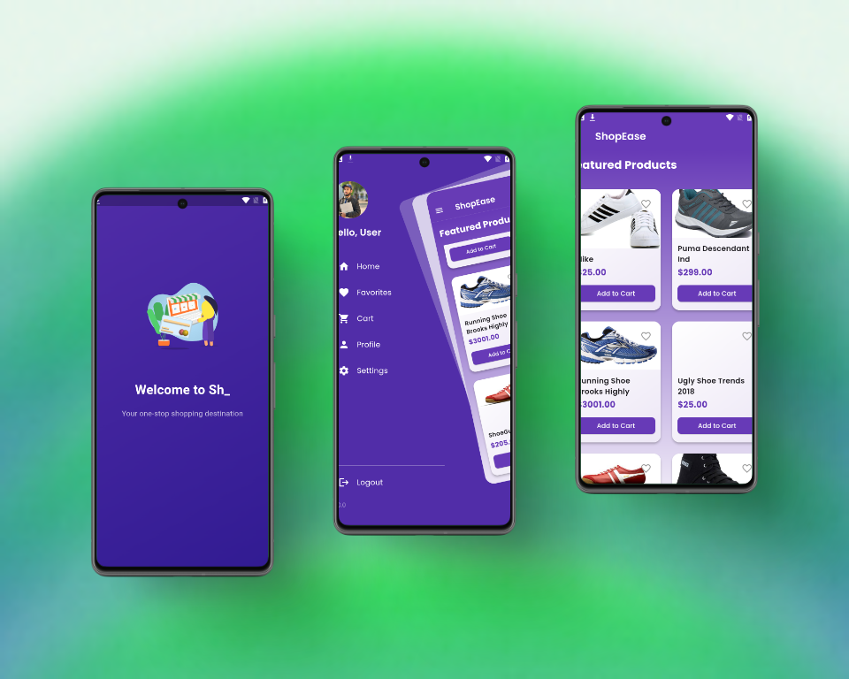
        </a> 
        <b>ShopEase</b> 
        Shopping | Flutter, Firebase 
        <a href="https://github.com/jamalihassan0307/ShopEase/releases/download/1.0.0/app-release.apk"><b>APK</b></a>
      </td>
      <td align="center" width="220">
        <a href="https://github.com/jamalihassan0307/Food-Dairy-app-sql" target="_blank">
          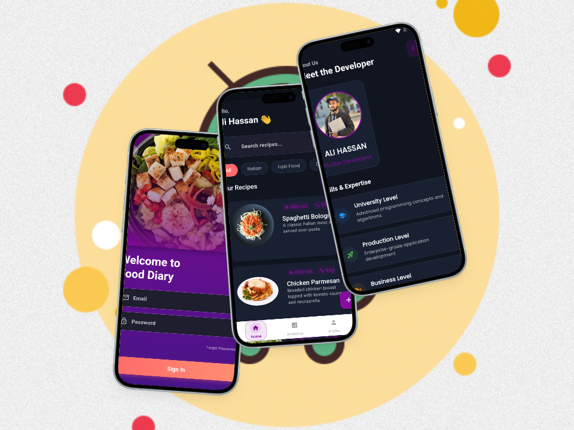
        </a> 
        <b>Food Dairy</b> 
        Nutrition Tracker | Flutter, SQLite 
        <a href="https://github.com/jamalihassan0307/Food-Dairy-app-sql/releases/download/1.0.0/app-release.apk"><b>APK</b></a>
      </td>
      <td align="center" width="220">
         
        <b>PetCare-Pro</b> 
        Pet Health | Flutter 
        <a href="https://github.com/jamalihassan0307/PetCare-Pro/releases/download/1.0.1/app-release.apk"><b>APK</b></a>
      </td>
    </tr>
    <tr>
      <td align="center" width="220">
        <a href="https://github.com/jamalihassan0307/Snab-Budget" target="_blank">
          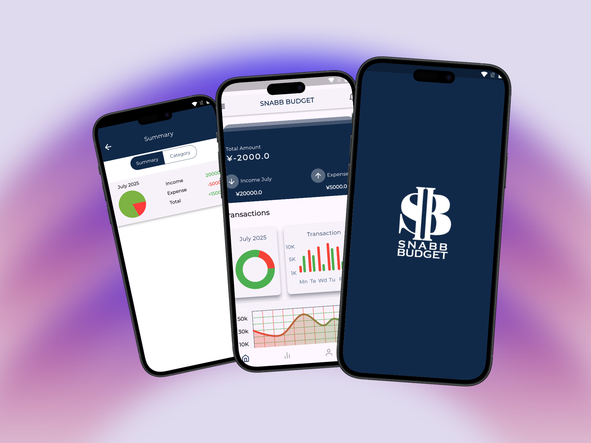
        </a> 
        <b>Snabb Budget</b> 
        Budget Management | Flutter, Dart 
        <a href="https://github.com/jamalihassan0307/Snab-Budget/releases/download/1.0.1/app-armeabi-v7a-release.apk"><b>APK</b></a>
      </td>
      <td align="center" width="220">
        <a href="https://github.com/jamalihassan0307/TaxTip" target="_blank">
          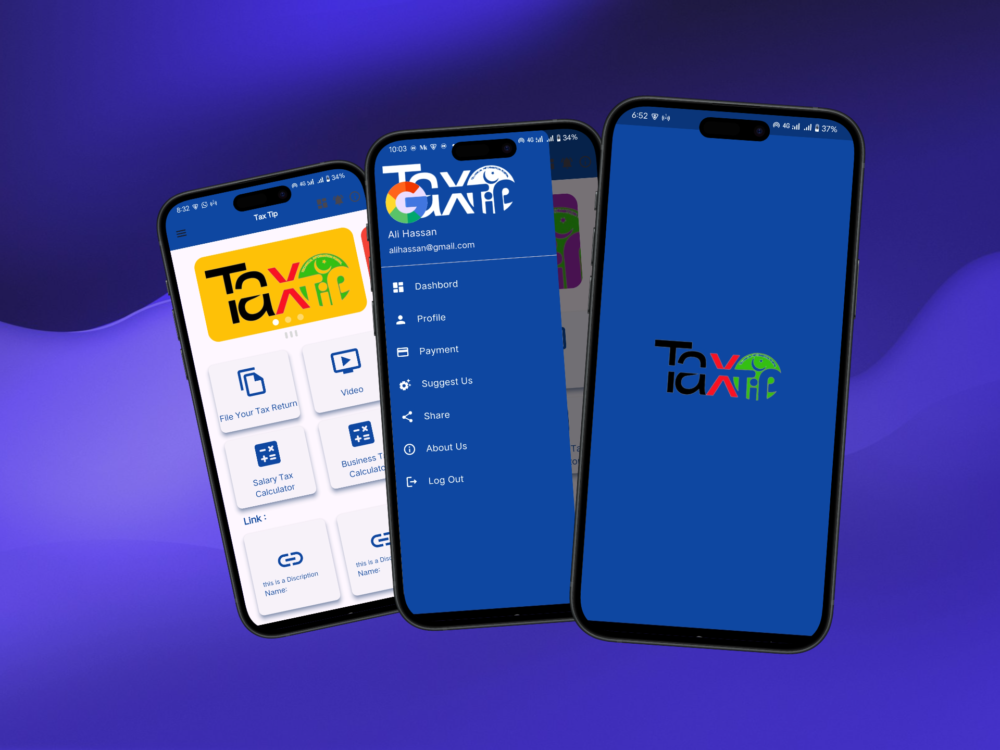
        </a> 
        <b>Taxtip</b> 
        Tax Management | Flutter 
        <a href="https://github.com/jamalihassan0307/TaxTip/releases/download/1.0.1/app-release.apk"><b>APK</b></a>
      </td>
      <td align="center" width="220">
        <a href="https://github.com/jamalihassan0307/Ui-kit" target="_blank">
          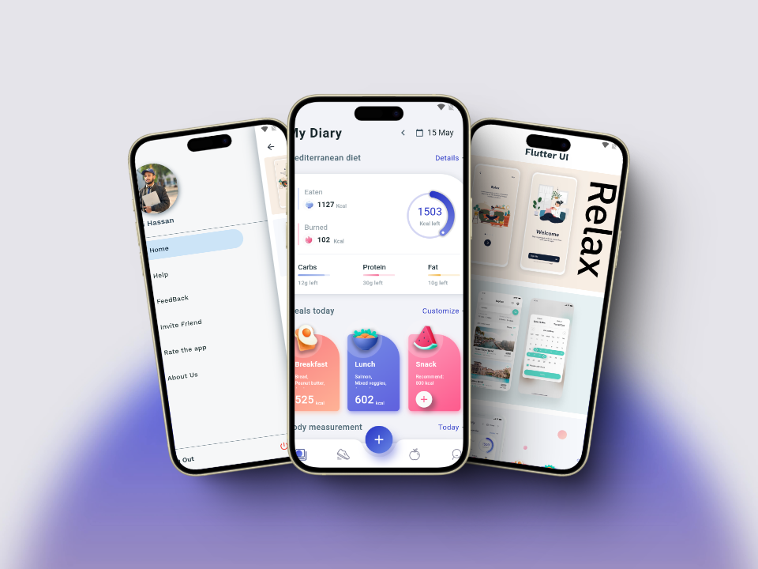
        </a> 
        <b>Ui-kit</b> 
        UI Animations | Flutter 
        <a href="https://github.com/jamalihassan0307/Ui-kit/releases/download/1.0.0/app-armeabi-v7a-release.apk"><b>APK</b></a>
      </td>
    </tr>
    <tr>
      <td align="center" width="220">
        <a href="https://github.com/jamalihassan0307/travel-blogging-platfoam" target="_blank">
          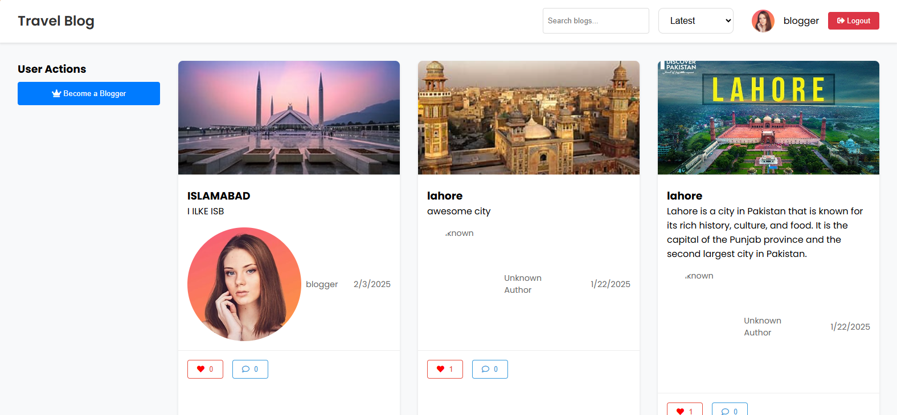
        </a> 
        <b>Travel Blogging</b> 
        Blog Platform | React, Firebase 
        <a href="https://jamalihassan0307.github.io/travel-blogging-platfoam/"><b>Demo</b></a>
      </td>
      <td align="center" width="220">
        <a href="https://github.com/jamalihassan0307/Flutter-Cake-App" target="_blank">
          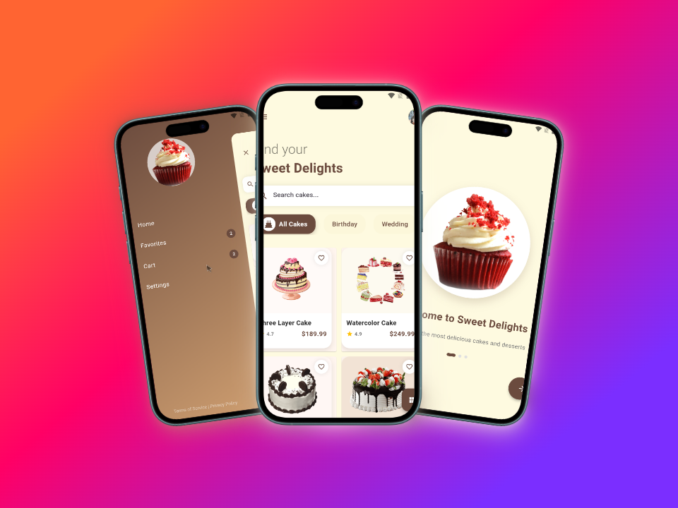
        </a> 
        <b>Cake App</b> 
        Cake Ordering | Flutter 
        <a href="https://github.com/jamalihassan0307/Flutter-Cake-App/blob/main/APK/app-armeabi-v7a-release.apk"><b>APK</b></a>
      </td>
      <td align="center" width="220">
        <a href="https://github.com/jamalihassan0307/IQRA" target="_blank">
          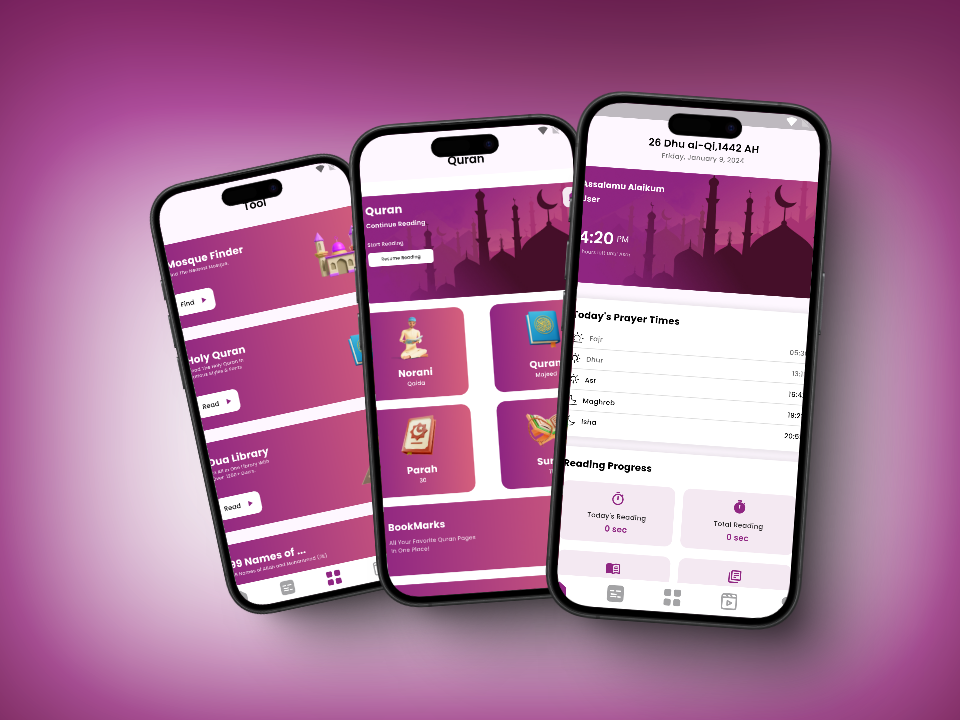
        </a> 
        <b>IQRA</b> 
        Islamic App | Flutter, Firebase 
        <a href="https://github.com/jamalihassan0307/IQRA/releases/download/1.0.0/app-armeabi-v7a-release.apk"><b>APK</b></a>
      </td>
    </tr>
    <tr>
      <td align="center" width="220">
        <a href="https://github.com/jamalihassan0307/7Skies" target="_blank">
          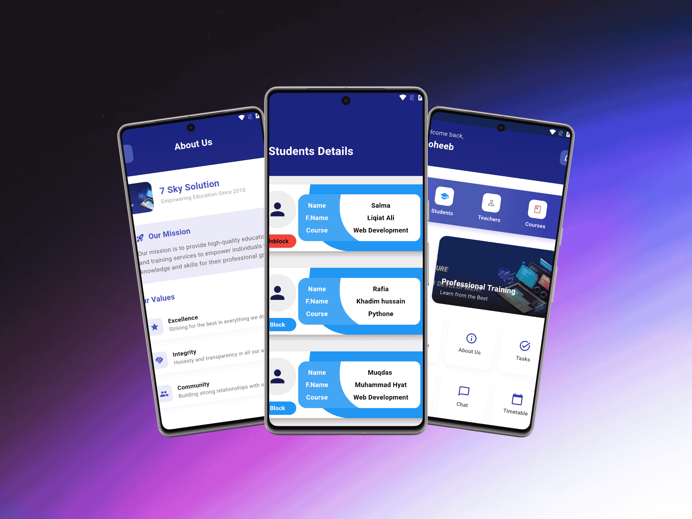
        </a> 
        <b>7 Skies Solution</b> 
        Educational Management | Flutter, Firebase 
        <a href="https://github.com/jamalihassan0307/7Skies/releases/download/1.0.0/app.apk"><b>APK</b></a>
      </td>
      <td align="center" width="220">
        <a href="https://github.com/jamalihassan0307/Snab-Business" target="_blank">
          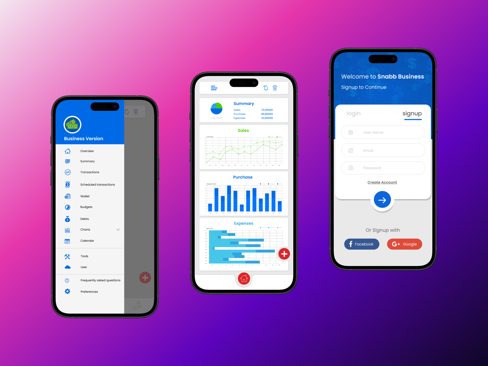
        </a> 
        <b>Snab Business</b> 
        Business & Finance | Flutter 
        <a href="#"><b>Demo</b></a>
      </td>
      <td align="center" width="220">
        <a href="https://github.com/jamalihassan0307/Simple-Ludo" target="_blank">
          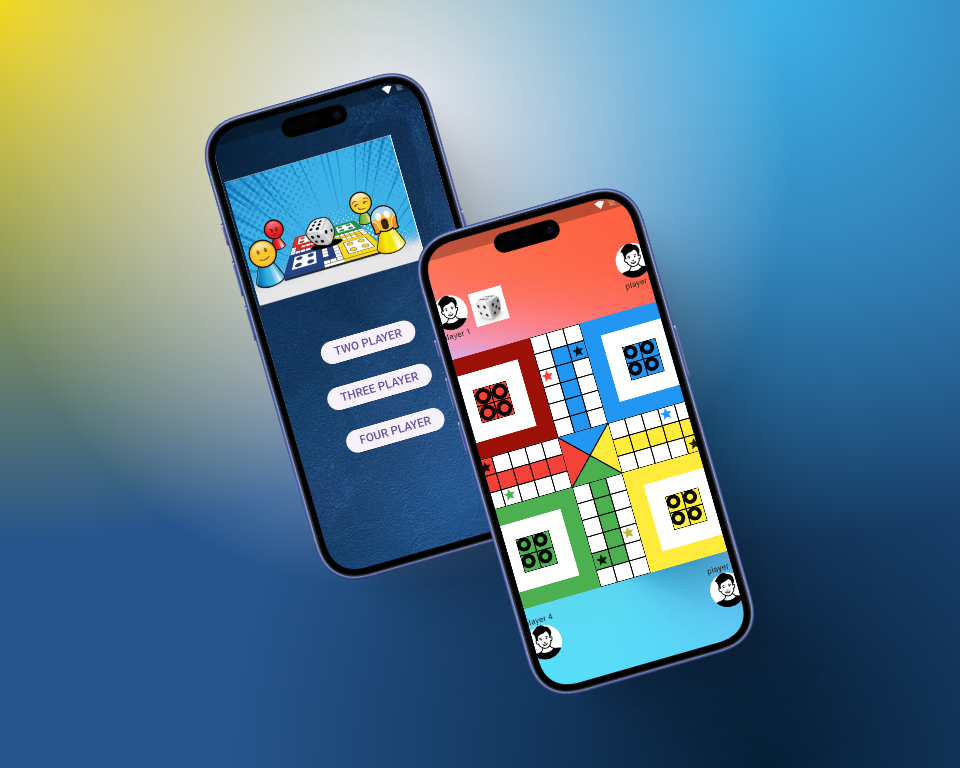
        </a> 
        <b>Ludo App</b> 
        Ludo Game | Flutter 
        <a href="https://github.com/jamalihassan0307/Simple-Ludo/releases/download/1.0.0/app-debug.1.apk"><b>APK</b></a>
      </td>
    </tr>
  </table>

<h3 align="center">VS Code Extensions</h3>

  <table>
    <tr>
      <td align="center" width="220">
        <b>Django Kick-Start</b> 
        One-click Django project setup | 3.6K+ installs 
        <a href="https://marketplace.visualstudio.com/items?itemName=7jsscmp4zaio626xj6rxx77zhgeosa4yry5vhbr3hu7gcgt4k73q.django-kick-start"><b>Marketplace</b></a>
      </td>
      <td align="center" width="220">
        <b>Flutter Fly</b> 
        Wireless debug & build automation | 2.8K+ installs 
        <a href="https://marketplace.visualstudio.com/items?itemName=7jsscmp4zaio626xj6rxx77zhgeosa4yry5vhbr3hu7gcgt4k73q.flutter-fly"><b>Marketplace</b></a>
      </td>
      <td align="center" width="220">
        <b>Advanced HTML & Django Snippets</b> 
        300+ Django/HTML snippets | 860+ installs 
        <a href="https://marketplace.visualstudio.com/items?itemName=7jsscmp4zaio626xj6rxx77zhgeosa4yry5vhbr3hu7gcgt4k73q.ahtml-django-snippets"><b>Marketplace</b></a>
      </td>
    </tr>
    <tr>
      <td align="center" width="220">
        <b>Flutter Architecture Generator</b> 
        MVVM/MVC/NextWay scaffolding | 255+ installs 
        <a href="https://github.com/jamalihassan0307/flutter-archichitecture-for-clean-code-vsCode-extension"><b>GitHub</b></a>
      </td>
      <td align="center" width="220">
        <b>Flutter Snippets Helper</b> 
        Essential Flutter widget snippets | 140+ installs 
        <a href="https://marketplace.visualstudio.com/items?itemName=7jsscmp4zaio626xj6rxx77zhgeosa4yry5vhbr3hu7gcgt4k73q.flutter-snippets-helper"><b>Marketplace</b></a>
      </td>
      <td></td>
    </tr>
  </table>

---

<!-- GITHUB STATS & TROPHIES -->
## 📊 GitHub Stats

  
  
  

---

<!-- DECORATIVE ELEMENTS -->

  

